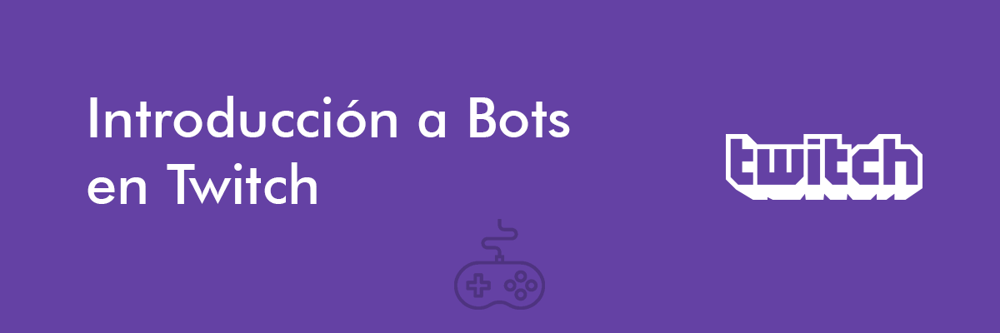

## Descripción
Twitch es una de las plataformas de live streaming que más ha crecido en los últimos años. Todos los días, millones de personas se conectan a la plataforma con el objetivo de buscar entrenerse, mejorar sus habilidades al jugar videojuegos, interactuar con su comunidad nicho, entre otros objetivos ([Sjöblom, Max et. al](https://www.researchgate.net/publication/311235384_Why_do_people_watch_others_play_video_games_An_empirical_study_on_the_motivations_of_Twitch_users)).

Es por esto que el estudio de la plataforma en estudios _Interacción Humano Computadora_ se ha convertido de interés ya que nos permite entender a profunidad los motivos y medios por los que la gente utiliza este tipo de plataformas así como comprender a profundidad el comportamiento de su audiencia, streamers y moderadores ([Seering, Joseph et. al](https://dl.acm.org/citation.cfm?id=3274426)). Finalmente, esto nos ayuda a entender como utilizamos este tipo de medios digitales y establecer propuestas de diseño para mejorar las interacciones y experiencias de los usuarios.

### Objetivos
En este workshop buscamos:
 - Explorar las oportunidades en investigación y desarrollo que tiene la construccion de bots en Twitch.
 - Construcción de un Bot que se conecté a un canal en Twitch.
 - Crear interacciones con el bot.

## Instalación
1. Clona el repositorio
```git
git clone https://github.com/PythonDayMX/PythonDayMexico2018.git

cd PythonDayMexico2018/IntroABotsEnTwitch
```
2. [Inicia sesión](https://www.twitch.tv/login) en Twitch o [crea una cuenta](https://www.twitch.tv/signup) nueva.
3. Consigue tu Twitch Chat OAuth Token en esta [página](http://twitchapps.com/tmi/)
4. Agrega tu oauth token a el archivo `_settings.py` y cambia el nombre a `settings.py` (solo quita el `_`).
5. 


## Ejecución

## Cómo Contribuir

